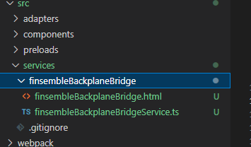

# Finsemble Backplane Bridge Service (Code Snippet)

Sample code snippet showcase integration of backplane with desktop agent 'finsemble'.Finsemble v7.3.2 is used.

## Installation

1. Copy the files under 'src/' to 'src/services/finsembleBackplaneBridge' in your finsemble project.




2. Go to appD.json file at path '$applicationRoot/public/configs/application' and add the following:

```JSON
   "finsembleBackplaneBridge":{
			"name": "finsembleBackplaneBridge",
			"appId": "finsembleBackplaneBridge",
			"manifest":
			{
				"bootParams":
				{
					"stage":"earlyuser",
					"stopOnFailure":false,
					"autoStart": true,
					"timeout":10000
				},
				"appService":true,
				"waitForInitialization":true,
				"window": {
					"url": "$applicationRoot/services/finsembleBackplaneBridge/finsembleBackplaneBridge.html"
				}
			}
			
		},
```

3. Install npm package '@finos/fdc3-backplane-client'.

```sh

# npm
npm install @finos/fdc3-backplane-client

#yarn
yarn add @finos/fdc3-backplane-client

```

4. Run: yarn run dev.

## License

Copyright (C) 2022 Backplane open source project

Distributed under the [Apache License, Version 2.0](http://www.apache.org/licenses/LICENSE-2.0).

SPDX-License-Identifier: [Apache-2.0](https://spdx.org/licenses/Apache-2.0)
