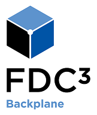

# Backplane Client .NET

.NET client exposing API to connect and communicate with backplane.

## Supported Platforms

The library is written in .NET standard 2.0.
.NET Standard 2.0 is supported by all modern platforms and is the recommended way to support multiple platforms with one target.

## Supported Features

- Broadcast context.

## Installation

    PM> Install-Package Finos.Fdc3.Backplane.Client

## Usage example

```C#
string? instrument = @"{
                type: 'fdc3.instrument',
                id: {
                    ticker: 'AAPL',
                    ISIN: 'US0378331005',
                    FIGI: 'BBG000B9XRY4',
                },
              }";

Uri backplaneUrl = new Uri("http://localhost:4475");
services.ConfigureBackplaneClient(new InitializeParams(new AppIdentifier() { AppId = "DesktopAgentNET" }), () => backplaneUrl);
ServiceProvider container = services.BuildServiceProvider();

//resolve from IOC
IBackplaneClient? backplaneClient1 = container.GetService<IBackplaneClient>();
await backplaneClient1.ConnectAsync(
//hook for receiving message from backplane
(msg) =>
{
    Console.WriteLine($"DesktopAgentNET: {JsonConvert.SerializeObject(msg)}{Environment.NewLine}");
},
//hook for disconnection with error.
async (ex) =>
{ await Task.CompletedTask; Console.WriteLine($"DesktopAgentNET: backplane disconnected. {ex}");
});
//broadcast
await backplaneClient2.BroadcastAsync(new Context(JObject.Parse(instrument)), "Channel 1");
```

## License

Copyright (C) 2022 Backplane open source project

Distributed under the [Apache License, Version 2.0](http://www.apache.org/licenses/LICENSE-2.0).

SPDX-License-Identifier: [Apache-2.0](https://spdx.org/licenses/Apache-2.0)
